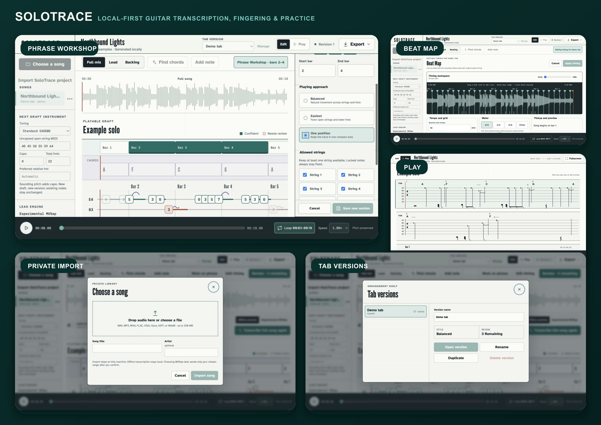
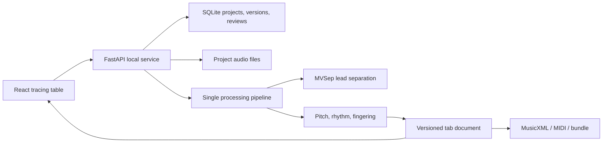

# SoloTrace

[](https://github.com/EzraCerpac/solotrace/actions/workflows/ci.yml)

SoloTrace turns a song's guitar part into a synchronized, editable tab and a
practice backing track. It transcribes the full song by default, opens with a
generated demo, and keeps projects in a private local library.
The private macOS beta offers an offline preview and an optional, explicitly
consented MVSep cloud path; transcription and editing stay local.

The honest product promise is **accurate notes with playable, editable
fingerings**. Audio rarely reveals which of several equivalent string and fret
positions a guitarist used.



SoloTrace is open source under the
[Apache License 2.0](LICENSE). Signed app builds remain a limited private beta;
see [`PRIVATE_BETA_TERMS.md`](PRIVATE_BETA_TERMS.md).

## What works

- Import common audio formats and transcribe the full song or optionally limit it
  to a selected section.
- Create a local transcription draft with exact audio times and score times.
- Switch between full mix, estimated lead, and backing audio without losing position.
- Accept, edit, reopen, delete, and undo low-confidence notes.
- Keep named tab versions; switching style creates a new balanced, easiest, or
  position-focused version without replacing the source.
- Rename, trash, restore, and reopen song projects.
- Loop a passage and slow playback while preserving pitch.
- Export the active tab as JSON, MusicXML 4.0, MIDI, or ASCII; export one bundle
  containing every version and the shared audio.
- Start instantly with the exact-stem `Northbound Lights` synthetic demo.

Uploaded songs use one selected route:

- **Experimental MVSep lead estimate:** foreground lead separation in MVSep's Germany
  cloud region, followed by local Spotify Basic Pitch note and bend transcription.
- **Offline preview:** frequency-focused separation plus librosa pYIN, always
  available without a key or network connection.

Every cloud run requires explicit confirmation that the user has rights to the
audio. Only the chosen range is uploaded.

## Hosted example studio

`site/` is a separate public Sites/Vinext shell for learning the editor without
an API key. It includes Northbound Lights, Switchback Run, and Low Orbit as
deterministic CC0 projects with exact full-mix, lead, and backing stems.

Anonymous visitors can play, edit, refinger, compare versions, and export in the
browser. Drafts stay in device-local storage. Sign in with ChatGPT is required
only to keep up to three private saved copies in D1; SoloTrace stores an HMAC
owner identifier instead of the raw email address. The hosted edition accepts no
uploads and runs no separation or transcription compute.

```bash
pnpm install
pnpm dev:site
```

Personal-audio processing remains a desktop feature.

## Architecture



One Python process owns orchestration and persistence. One React app owns the
editor. There is no Redis, cloud database, or application login. Integer audio
frames are the synchronization truth; score ticks are retained separately for
notation.

## Run it

Requirements: macOS or Linux, FFmpeg, `uv`, `pnpm`, and `mise`.

```bash
mise run install
mise run install-models
pnpm --dir web build
mise run server
```

Open <http://127.0.0.1:8765>. For live development:

```bash
# Terminal 1
mise run api

# Terminal 2
mise run web
```

The Vite app runs at <http://127.0.0.1:5173> and proxies `/api` and `/media` to
the Python service.

The macOS app stores a tester-supplied MVSep key through Keychain service
`com.ezracerpac.solotrace`. Add, replace, or remove it from the app; it is never
passed through shell commands.

On Linux, set `SOLOTRACE_MVSEP_API_TOKEN`.

To build an installable wheel, build the web app first. Hatch bundles the
generated assets into the wheel; `web/dist` remains ignored in the checkout.

```bash
pnpm --dir web build
uv build --wheel
```

## Verify it

```bash
mise run check
mise run smoke-wheel
mise run package-macos
mise run smoke-app
```

`package-macos` creates an ad-hoc signed Apple-Silicon `SoloTrace.app`. It builds
and bundles a pinned LGPL-only FFmpeg from official source. A Developer ID
identity and notarization keychain profile are required for `mise run
release-macos`; that command emits the notarized DMG and SHA-256 checksum.

Tests focus on the parts that protect real work: fingering legality, revision
conflicts, parseable exports, exact demo stems, media range requests, and the
production build.

CI runs Python lint/tests, TypeScript checks, web tests, the production web
build, and an installed-wheel smoke test on every pull request and `main` push.
See [`CONTRIBUTING.md`](CONTRIBUTING.md).

## Private beta releases

Signed builds appear in [GitHub Releases](https://github.com/EzraCerpac/solotrace/releases)
after Apple Developer enrollment and notarization credentials are configured.
Release automation builds on GitHub's Apple-Silicon macOS runner, signs nested
binaries, notarizes and staples the DMG, verifies Gatekeeper, publishes a
prerelease, and attaches its SHA-256 checksum.

- Tester instructions: [`docs/beta/BETA_GUIDE.md`](docs/beta/BETA_GUIDE.md)
- Privacy notice: [`docs/beta/PRIVACY.md`](docs/beta/PRIVACY.md)
- MVSep disclosure: [`docs/beta/MVSEP_DISCLOSURE.md`](docs/beta/MVSEP_DISCLOSURE.md)
- Maintainer release guide: [`docs/releasing.md`](docs/releasing.md)

## Processing model

The full lead path is:

1. MVSep one-stage Lead/Rhythm separation for the whole song or selected section.
2. Local Spotify Basic Pitch polyphonic note and bend estimation.
3. librosa beat estimation while retaining exact audio timestamps.
4. Playability optimization across legal string/fret positions.
5. Manual synchronized correction.

The UI defaults to offline preview. MVSep is a separate explicit choice when a
key and the bundled Basic Pitch/CoreML runtime are available. MVSep selections
may be at most 10 minutes. Offline transcription accepts any song allowed by the
30-minute importer and processes long audio in cancellable, bounded-memory chunks.
See [`docs/lead-separation-benchmark-results.md`](docs/lead-separation-benchmark-results.md)
for the separator decision and
[`docs/model-benchmark-results.md`](docs/model-benchmark-results.md) for the
12-song transcription evaluation.

## Project data

Runtime data uses the private per-user application-data directory
(`~/Library/Application Support/SoloTrace` on macOS, the XDG data directory on
Linux). Set `SOLOTRACE_DATA_DIR` to override it.

Source development can still use the isolated `.workers` transcription
environment. The native app reuses its own executable as the Basic Pitch worker
and has no external worker environment.

```text
SoloTrace/
├── solotrace.sqlite3
└── projects/
    └── <project-id>/
        ├── original.wav
        ├── lead-run-<id>.wav
        └── backing-run-<id>.wav
```

Each song stores shared audio and named tab versions. Notes keep model confidence
separate from the musician's reviewed/unreviewed decision. A project-wide
revision token protects every edit, version action, title, trash state, and
selected section; a stale editor gets HTTP `409` instead of silently overwriting
newer work. Processing and draft-style actions always create a new version.
Projects in Trash remain recoverable.

The browser remembers the last project plus track, speed, loop, and draft scope.
SQLite remains the source of truth for projects, versions, note reviews, names,
selected sections, and trash state. Playback position and note selection
intentionally reset when reopening.
Data/project directories are created owner-only; the SQLite file is owner-readable
and owner-writable.

## Copyright and privacy

Import and upload only audio you are allowed to process. Desktop project metadata,
edits, and exported tabs remain local. A confirmed cloud run sends the chosen
audio range to MVSep's Germany region and downloads a lossless lead stem; see
MVSep's privacy policy and terms before use.

The hosted example studio never accepts personal audio. Anonymous drafts stay in
the browser; signed-in saved copies store only the edited example document and a
server-derived owner identifier.

SoloTrace does not fetch YouTube URLs:
local URL downloading adds platform-terms, copyright, and server-side request
risks without improving the transcription core. A future desktop-only importer
can be evaluated separately.

The bundled demo is synthesized locally and contains no third-party recording.

Security reports belong in a private GitHub security advisory, not an issue.
See [`SECURITY.md`](SECURITY.md).

## License

Copyright 2026 Ezra Cerpac. Licensed under the
[Apache License 2.0](LICENSE). Third-party components retain their own licenses;
see [`THIRD_PARTY_NOTICES.md`](THIRD_PARTY_NOTICES.md).
