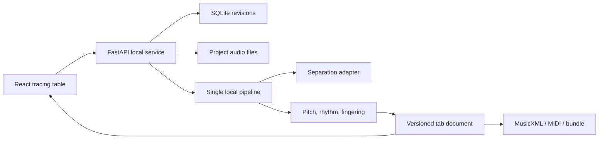

# SoloTrace

SoloTrace turns a recorded guitar solo into a synchronized, editable tab and a
practice backing track. It is local-first: songs stay on this machine, the app
opens with a generated demo, and no account or API key is required.

The honest product promise is **accurate notes with playable, editable
fingerings**. Audio rarely reveals which of several equivalent string and fret
positions a guitarist used.

## What works

- Import common audio formats and mark the solo on a waveform.
- Create a local transcription draft with exact audio times and score times.
- Switch between full mix, estimated lead, and backing audio without losing position.
- Edit string, fret, timing, pitch, technique, and confidence per note.
- Regenerate only the fingering as balanced, easiest, or position-focused.
- Loop a passage and slow playback while preserving pitch.
- Export native project JSON, MusicXML 4.0, MIDI, ASCII tab, or a ZIP with audio.
- Start instantly with the exact-stem `Northbound Lights` synthetic demo.

Uploaded songs offer two explicit local engines:

- **Enhanced local:** Demucs-MLX `htdemucs_6s` guitar separation plus Spotify
  Basic Pitch note and bend transcription.
- **Fast preview:** frequency-focused separation plus librosa pYIN.

Enhanced separation removes the combined guitar estimate, not reliably only the
lead guitar. The UI and project provenance keep that limitation visible.

## Architecture



One Python process owns orchestration and persistence. One React app owns the
editor. There is no Redis, cloud database, authentication layer, or required
service account. Integer audio frames are the synchronization truth; score ticks
are retained separately for notation.

## Run it

Requirements: macOS or Linux, FFmpeg, `uv`, `pnpm`, and `mise`.

```bash
mise run install
mise run install-models
pnpm --dir web build
mise run server
```

Open <http://127.0.0.1:8765>. For live development:

```bash
# Terminal 1
mise run api

# Terminal 2
mise run web
```

The Vite app runs at <http://127.0.0.1:5173> and proxies `/api` and `/media` to
the Python service.

To build an installable wheel, build the web app first. Hatch bundles the
generated assets into the wheel; `web/dist` remains ignored in the checkout.

```bash
pnpm --dir web build
uv build --wheel
```

## Verify it

```bash
mise run check
mise run smoke-wheel
```

Tests focus on the parts that protect real work: fingering legality, revision
conflicts, parseable exports, exact demo stems, media range requests, and the
production build.

## Processing model

The enhanced draft path is deterministic and account-free:

1. Demucs-MLX `htdemucs_6s` all-guitar separation for the marked passage.
2. Spotify Basic Pitch polyphonic note and bend estimation.
3. librosa beat estimation while retaining exact audio timestamps.
4. Playability optimization across legal string/fret positions.
5. Manual synchronized correction.

The UI selects Enhanced local when both isolated workers are installed and
always keeps Fast preview available. The first enhanced separation downloads a
52 MB converted model file. Worker environments currently use about 1.7 GB.
See [`docs/model-benchmark-results.md`](docs/model-benchmark-results.md) for the
12-song evaluation and [`docs/model-evaluation.md`](docs/model-evaluation.md)
for installation and limitations.

## Project data

Runtime data uses the private per-user application-data directory
(`~/Library/Application Support/SoloTrace` on macOS, the XDG data directory on
Linux). Set `SOLOTRACE_DATA_DIR` to override it.

Enhanced worker environments default to `.workers` in a source checkout. Set
`SOLOTRACE_WORKER_DIR` when starting an installed wheel from elsewhere.

```text
SoloTrace/
├── solotrace.sqlite3
└── projects/
    └── <project-id>/
        ├── original.wav
        ├── lead-run-<id>.wav
        └── backing-run-<id>.wav
```

Generated proposals and user edits receive distinct revisions. A stale editor
gets HTTP `409` instead of silently overwriting a newer revision.
Data/project directories are created owner-only; the SQLite file is owner-readable
and owner-writable.

## Copyright and privacy

Import audio you are allowed to process. SoloTrace does not fetch YouTube URLs:
local URL downloading adds platform-terms, copyright, and server-side request
risks without improving the transcription core. A future desktop-only importer
can be evaluated separately.

The bundled demo is synthesized locally and contains no third-party recording.
